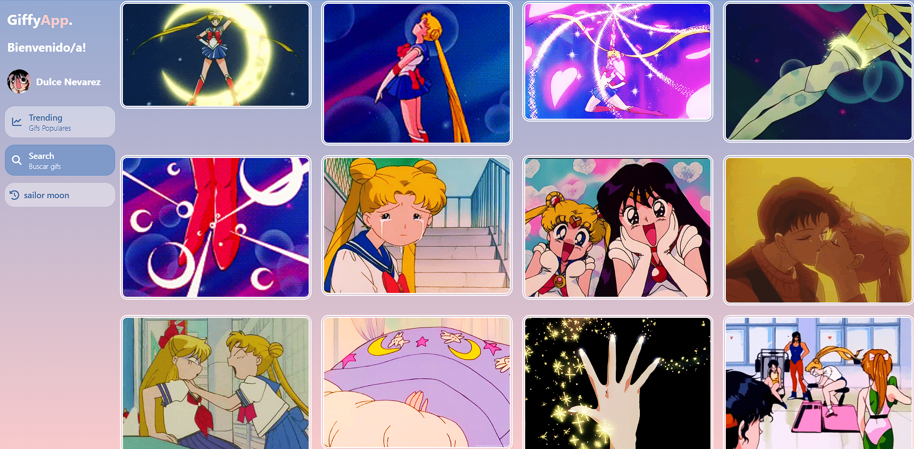

# Buscador de GIFs con Angular

¡**Giffy App**! 🌸  
Una aplicación web hecha con **Angular** y **Tailwind CSS** que te permite buscar GIFs divertidos, explorar los más populares y guardar tu historial de búsqueda de forma dinámica y ordenada 💫

## ✨ Funcionalidades

- 🔍 **Buscador de GIFs**: Escribe una palabra clave y encuentra los GIFs que estás buscando al instante.
- 📜 **Historial de búsqueda**: Guarda automáticamente tus últimas búsquedas para que accedas fácilmente sin tener que escribir de nuevo.
- 🚀 **Tendencias**: Mira los GIFs más populares del momento, actualizados automáticamente.
- 🌈 **Interfaz moderna**: Diseño responsive y cute gracias a Tailwind CSS.

## 🛠️ Tecnologías utilizadas

- [Angular](https://angular.dev/) – Framework principal
- [Tailwind CSS](https://tailwindcss.com/) – Para los estilos
- [Giphy](https://giphy.com/) – Fuente de los GIFs

_Puedes ver la demostracion del proyecto en el siguiente enlace_

- [Demo](https://gifs-app-lovat.vercel.app/dashboard/trending)
